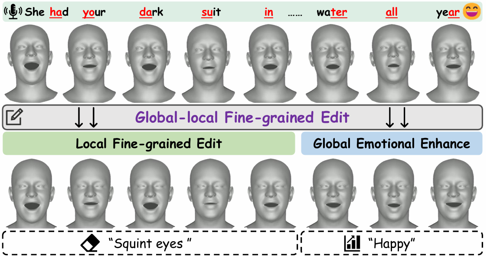
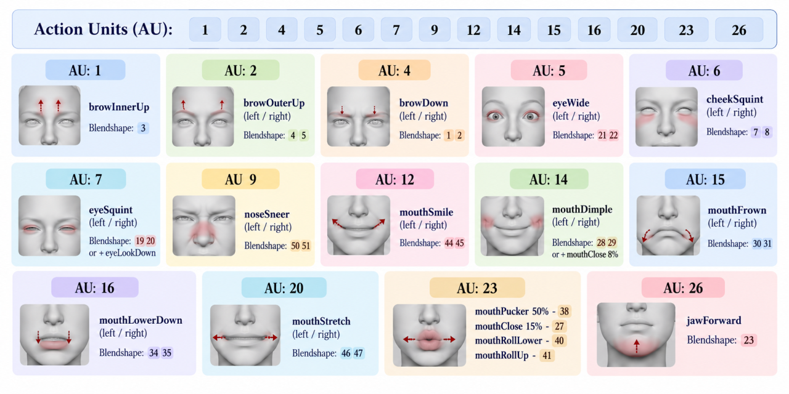

# EmoPoseFace (TVCG'26)
Code repository for the implementation of: *EmoPoseFace: Head Pose Aware Speech-driven 3D Emotional facial Animation using Latent Diffusion.*
> 
> This GitHub repository contains the PyTorch implementation of EmoPoseFace.
> EmoPoseFace generates speech-driven 3D emotional facial animations with coordinated head poses through a dual-branch diffusion framework.
> It further incorporates the GL-FFE module to provide controllable global emotional enhancement and local fine-grained facial motion editing while maintaining natural motion transitions.

<p align="center"> 

</p>

> [Paper](https://ieeexplore.ieee.org/abstract/document/11557258) [Project Website](https://github.com/zaqwsx6/EmoPoseFace)

## Environment

- Linux and Windows (no test)
- Python 3.9+
- PyTorch 1.10.1+cu111

## Dependencies

- [ffmpeg](https://www.ffmpeg.org/download.html)
- Check the required python packages and libraries in `requirements.txt`.
- Install them by running the command: `pip install -r requirements.txt`

## Data
### MEAD


#### MEAD Data Preparation and Data Pre-process 
For training on the MEAD dataset, we use the FLAME parameters reconstructed from the original videos. The data should be preprocessed as follows:

1. **Expression Mesh:** Convert the `expression` parameters from FLAME into 3D facial meshes. Each mesh is represented as a flattened **15,069-dimensional vector** (5,023 vertices × 3 coordinates).

2. **Head Pose:** Extract the corresponding `pose` parameters from FLAME to represent the head motion.

3. **Joint Training:** The converted expression meshes and the corresponding FLAME pose parameters are used together to train EmoPoseFace, enabling the joint modeling of emotional facial expressions and coordinated head poses.

The processed data for each sequence should therefore contain the **3D facial mesh representation (dim = 15,069)** and its corresponding **FLAME pose parameters**.

Facial Template：

## Model Training 

### Training and Testing

| Arguments     | MEAD                        |
|---------------|-----------------------------|
| --dataset     | mead                        |
| --vertice_dim | expression: 15069 + pose: 6 | 
| --output_fps  | 30                          |

- Train the model by running the following command:
	```
	python main_mead_exp_pose_GRU04_posestyle_2gru.py
	```
    Includes training and test inference
	The test split predicted results will be saved in the `result/`. The trained models (saves the model in 25 epoch interval) will be saved in the `save/` folder.


[//]: # (### Predictions)

[//]: # ()
[//]: # (- Download the trained weights from [here]&#40;https://mega.nz/folder/jlBF0Dpa#U3G1lJCZ4dijMoSc9gmqSg&#41; and add them to the folder `pretrained_models`.)

[//]: # (- To generate predictions use the commands:)
 
### Evaluation and Visualization

- Additional Environment (Evaluation，Visualization，Global-local Facial Fine-grained Editing)

The evaluation, visualization and editing environments should be based on the following: 
FLAME: Articulated Expressive 3D Head Model (PyTorch) https://github.com/soubhiksanyal/FLAME_PyTorch

- Evaluation and Visualization in the file “mead_evaluation”
  - Evaluation
    ```
      BA: python mead_evaluation/metric_BA.py
      Other: python mead_evaluation/exp_pose_metric.py
    ```
  - Visualization
    ```
      python mead_evaluation/main_mead_flame_to_3Dmesh_express+pose_render_posemodel02_withpose.py
    ```
    
### Global-local Facial Fine-grained Editing Module

> Please refer to the Arkit 52 blendshape Visual Control Panel and the AU combination diagram when editing characters. 
> Use Steps 1 and 2 for Global-emotion edit, and Step 3 for local fine-grained edit.

> Note: Edits must be based on the Arkit blendshapes corresponding to the controls in the Arkit 52 blendshape Visual Control Panel in Steps 1, 2, and 3. Refer to the diagram for the AU combination, and see Table 1 in the paper for the emotion combinations.

  <p align="center"> 
  
  </p>

- In the file “ARkit_edit-emoposetalk”
  - Arkit 52 blendshape Visual control panel
    ```
    python ARkit_edit-emoposetalk/arkit_control_1.py
    ```
  -  Global-emotion edit
    ```
    Step 1：
    python ARkit_edit-emoposetalk/Arkit_3Dmesh/arkit_3dmesh_edit_2Step.py
    Step 2：
    python ARkit_edit-emoposetalk/Arkit_3Dmesh/arkit_edit_3Step.py
    ```
  - local fine-grained edit 
    ```
    Step 3：
    python ARkit_edit-emoposetalk/Arkit_3Dmesh/linner-edit_4Step.py
    ```    


  
  

## Acknowledgements

We borrow and adapt code from [FaceDiffuser](https://github.com/uuembodiedsocialai/FaceDiffuser),
[DiffPoseTalk](https://github.com/DiffPoseTalk/DiffPoseTalk), and
[Flame_Pytorch](https://github.com/soubhiksanyal/FLAME_PyTorch).
We sincerely thank the authors for making their code publicly available and facilitating future research.

We also thank [Hugging Face Transformers](https://huggingface.co/) for providing the implementation of HuBERT used for speech feature extraction.

We are grateful for the publicly available resources used in this project:
- The authors of the MEAD dataset for providing the emotional talking-face dataset used in our experiments.
- The authors of FLAME for providing the parametric 3D face model used for facial motion representation and reconstruction.

Any third-party code, models, datasets, and packages are owned by their respective authors and must be used under their respective licenses.

## License
This repository is released under [CC-BY-NC-4.0-International License](https://github.com/Gibberlings3/GitHub-Templates/blob/master/License-Templates/CC-BY-NC-4.0/LICENSE-CC-BY-NC-4.0.md)
